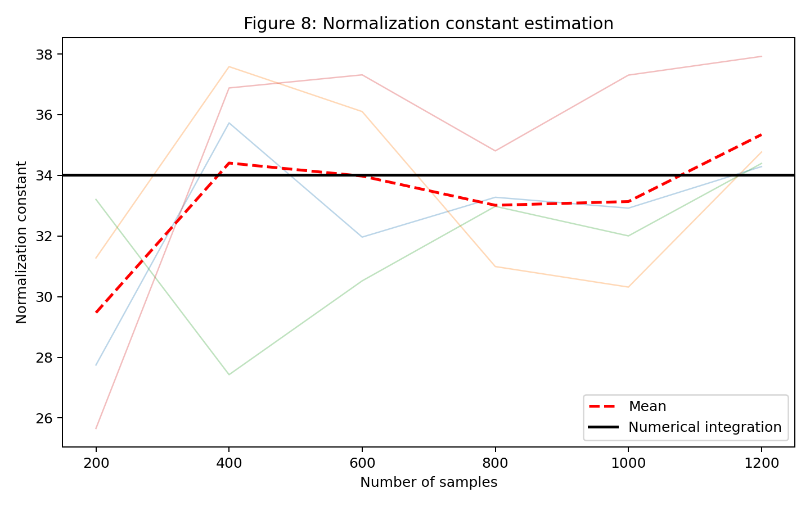
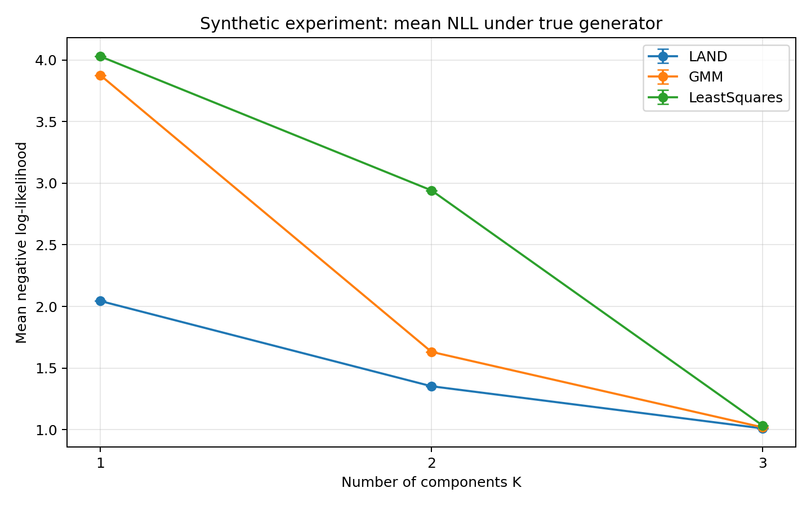

# Locally Adaptive Normal Distribution (LAND) - JAX Implementation

[](https://github.com/google/jax)

This repository provides a highly scalable, GPU-accelerated implementation of the **Locally Adaptive Normal Distribution (LAND)** framework using **JAX**. This project addresses the computational bottlenecks of manifold density estimation by utilizing modern hardware and algorithmic optimizations.

## 📌 Project Overview

Traditional Euclidean density estimation relies on the standard multivariate Gaussian, which fails to capture the true geometric structure of data residing on non-linear, curved manifolds. LAND resolves this by dynamically adapting a Riemannian metric tensor to the data, allowing the "distance" between points to respect the underlying topology.

### Key Innovations & Improvements:
- **Corrected Geodesic ODEs**: Fixed a critical error in the original LAND paper's geodesic equation, ensuring mathematically sound trajectories.
- **JAX-based Parallelization**: Refactored from PyTorch to JAX to leverage massive GPU parallelism for geodesic computations and JIT-compiled gradients.
- **KNN Shortest-Path Initialization**: Replaced straight-line initialization with graph-based shortest paths, significantly improving convergence and geometric accuracy.
- **Segmented Shooting Method**: Discretizes the geodesic Boundary Value Problem (BVP) into $K$ sub-intervals, significantly increasing the robustness of the Levenberg-Marquardt solver for distant points.
- **Riemannian Covariance Scaling**: Implemented essential scaling of logarithmic maps to ensure consistency between Euclidean precision updates and Riemannian curve lengths.

---

## 📂 Repository Structure

```text
├── src/
│   ├── models/
│   │   ├── land.py             # Core LAND MLE implementation (JAX)
│   │   └── mixture_model.py    # Multi-component mixture model with EM
│   ├── experiments/
│   │   ├── land_paper_full.py  # Full-scale experiment suite
│   │   └── synthetic_land_paper.py
│   ├── scripts/
│   │   ├── main_land.py        # Single LAND distribution fitting
│   │   ├── main_mm.py          # Mixture model (EM) execution
│   │   ├── main_geodesics.py   # Geodesic visualization & testing
│   │   └── main_paper_experiments.py
│   ├── data/
│   │   ├── synthetic.py        # Generators for Halves, Moons, etc.
│   │   └── physionet_eeg.py    # Real-world EEG dataset handlers
│   └── utils/
│       ├── land_utils.py       # Riemannian metrics, BVP solvers, KNN graph
│       └── plotting_utils.py   # Contour & density visualization
├── plots/                      # Generated results from experiments
└── tests/                      # Validation suite for math & JAX kernels
```

---

## 🚀 Execution & Scripts

The repository offers several ways to run and test the framework:

### 1. Simple LAND Fitting
Fit a single Locally Adaptive Normal Distribution to a dataset.
```bash
python src/scripts/main_land.py
```

### 2. Mixture Model (Clustering)
Run the Expectation-Maximization script to fit multiple LAND components (e.g., to the "Two Moons" dataset). Includes specialized GPU memory management for JAX.
```bash
python src/scripts/main_mm.py
```

### 3. Geodesic Visualization
Visualize how the LAND metric warps space and computes geodesics compared to Euclidean straight lines.
```bash
python src/scripts/main_geodesics.py
```

### 4. Full Paper Reproduction
Standardized script to run the full suite of experiments used in the accompanying report.
```bash
python src/scripts/main_paper_experiments.py
```

---

## 📊 Results & Visualization

### Manifold Density Estimation
The implementation successfully captures non-linear topologies that standard MLEs "flatten."


### Optimization Performance
One of the critical findings of this project was the scalability of the segmented BVP solver.

- **Normalization Constant**: Estimated via Monte Carlo to ensure valid probability densities.
- **Geodesic Scalability**: JAX JIT-compilation allows batching thousands of geodesic computations simultaneously.

| Normalization Convergence | Convergence (Negative Log-Likelihood) |
|:---:|:---:|
|  |  |

---

## 🛠 Technical Details

### Segmented BVP Solver & Corrected ODEs
One of the most significant fixes in this repository is the correction of the geodesic equation from the original Arvanitidis et al. (2016) paper. The original formulation was missing a term involving the velocity coupling with the metric gradient:

**Original (Incorrect):**
$$\gamma''(t) = -\frac{1}{2}M^{-1} \left[ \frac{\partial \text{vec}[M]}{\partial \gamma} \right]^T (\gamma' \otimes \gamma')$$

**Current (Corrected):**
$$\gamma''(t) = M^{-1} \left( \frac{1}{2} \left[ \frac{\partial \text{vec}[M]}{\partial \gamma} \right]^T (\gamma' \otimes \gamma') - (\gamma'^T \otimes I_D) \left[ \frac{\partial \text{vec}[M]}{\partial \gamma} \right] \gamma' \right)$$

By splitting the path $[0, 1]$ into $K$ segments and using this corrected ODE, our solver ensures $pos_{k+1} - pos_k = 0$ and $vel_{k+1} - vel_k = 0$ at every junction. This "multiple shooting" approach, combined with KNN-based shortest path initialization, makes the log-map computation remarkably robust.

### Riemannian Precision Updates
To ensure the covariance $\Sigma$ remains in the space of positive-definite matrices $\mathcal{S}^{D}_{++}$, we parameterize it via a precision factor matrix $A$ ($\Sigma^{-1} = A^TA$) and perform **Riemannian Gradient Descent** directly on $A$. Crucially, we scale the logarithmic maps during these updates to ensure their Euclidean norm matches the actual Riemannian arc length, maintaining geometric consistency.

---

## 📝 Authors
- **Adrian Pittaway** (Imperial College London)
- **Daniel Sánchez Sánchez** (Imperial College London)
- **Temi Messner** (Imperial College London)

*This project was developed for the Non-Euclidean Methods in Machine Learning (NEML) course coursework.*
